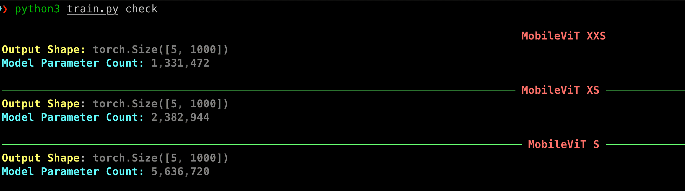
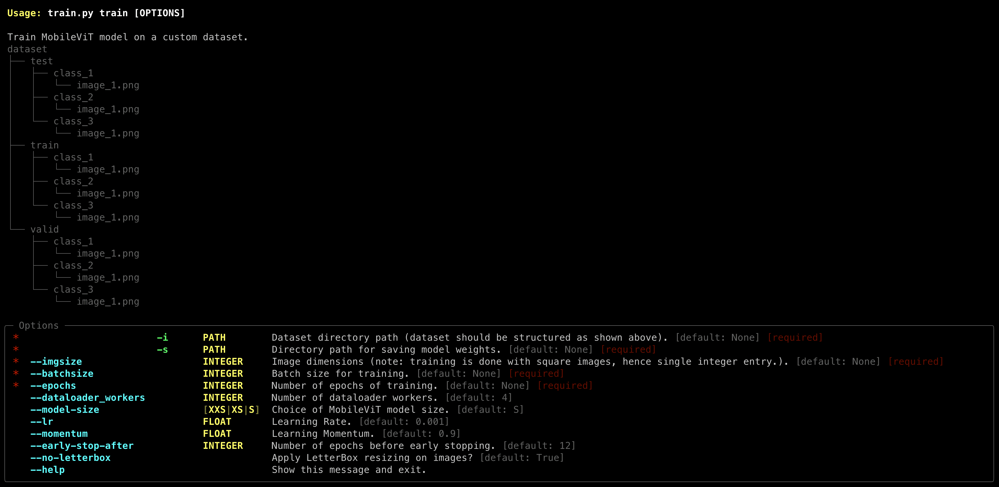
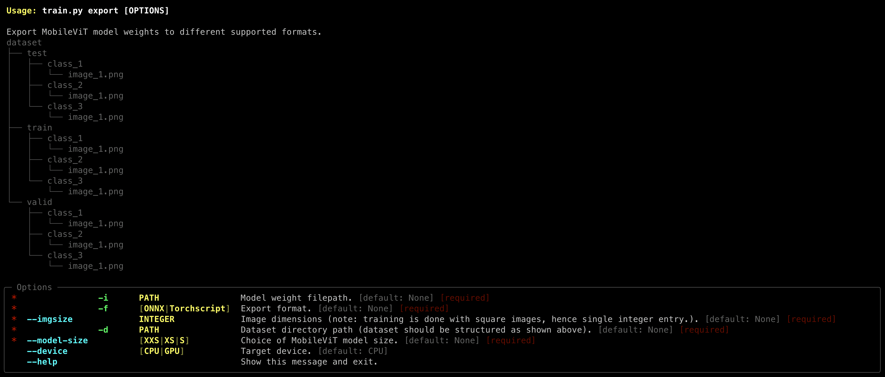

# MobileViT
A PyTorch implementation of MobileViT as presented in the paper ["MobileViT: Light-weight, General-purpose, and Mobile-friendly Vision Transformer"](https://arxiv.org/abs/2110.02178).


## Tutorial
**READ:** [How to Train MobileViT on a Custom Dataset](https://mlbasics.com/train-mobilevit-custom-dataset)


## Install Dependencies
```python
# install dependencies
pip3 install 'typer[all]' rich einops matplotlib jupyterlab numpy \
ipywidgets onnxruntime pillow opencv-python
 
# install pytorch (CUDA 11.6)
pip3 install torch torchvision torchaudio \
--extra-index-url https://download.pytorch.org/whl/cu116

# install pytorch (CPU)
pip3 install torch torchvision torchaudio
```

## Classifier Training
Check whether all dependencies are satisfied. This :point_down: will run a random `torch tensor` through the three MobileViT architectures and print their sizees (# of model parameters).

```python
python3 train.py check
```


Before proceeding to train MobileViT on a custom dataset. Ensure the dataset is structured as shown below:
```treeview
dataset
├── test
│   ├── class_1
│   │   └── image_1.png
│   ├── class_2
│   │   └── image_1.png
│   └── class_3
│       └── image_1.png
├── train
│   ├── class_1
│   │   └── image_1.png
│   ├── class_2
│   │   └── image_1.png
│   └── class_3
│       └── image_1.png
└── valid
    ├── class_1
    │   └── image_1.png
    ├── class_2
    │   └── image_1.png
    └── class_3
        └── image_1.png
``` 

To start classification model training, type the following command:
```python
python3 train.py train -i <dataset_dir> -s <model_weights_savedir>\
 --imgsize 256 --batchsize 32 --epochs 100 --model-size XXS/XS/S
```

To check all available options for training, type the command:
```python
python3 train.py train
```
This :point_up: will print a help dialog showing all the options that can be configured.



## Model Export
To export trained MobileViT model to ONNX or TorchScript format, type the command:
```python
python3 train.py export
```
This :point_up: will list all the arguments that need to be passed to successfully export the model to the supported formats.



Assuming you followed the tutorial above :point_up:, we can export that model to ONNX format using the command:
```python
python3 train.py export -i weights/mobilevit_s_birds400.pth\
 -d birds400-dataset  -f ONNX --imgsize 256 --model-size S --device CPU 
```

## Citation
```
@article{mehta2021mobilevit,
  title={MobileViT: Light-weight, General-purpose, and Mobile-friendly Vision Transformer},
  author={Mehta, Sachin and Rastegari, Mohammad},
  journal={arXiv preprint arXiv:2110.02178},
  year={2021}
}
```

## Credits
Code adopted from [MobileViT-PyTorch](https://github.com/chinhsuanwu/mobilevit-pytorch).
